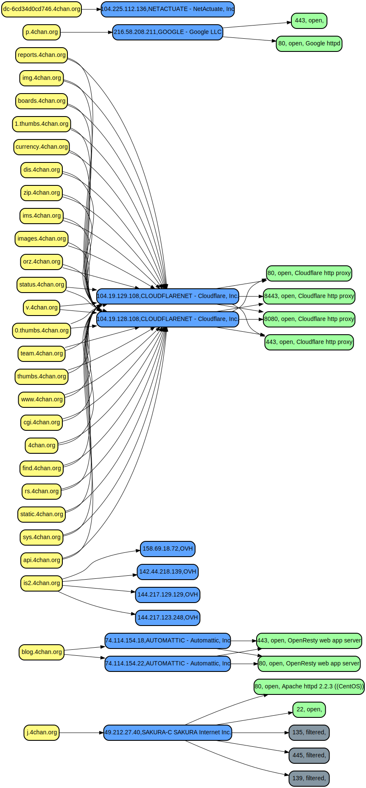

# Description

Parse pentest log files under a target directory and output the parsed infos to a choosen format (see below).
Currently only nmap and amass logs are supported. The tool expects these logs in sub-directories.

For Example:

```
$ tree test-logs
test-logs
├── amass
│   ├── domains.json        <-- tool will parse this file
│   └── domains.txt
└── nmap
    ├── sSCV-top-500.gnmap  <-- and this file
    ├── sSCV-top-500.nmap
    ├── sSCV-top-500.xml
    └── start.lst

2 directories, 6 files
```

Example amass run:

```
amass enum -d 4chan.org -oA domains
```

Example nmap run:

```
sudo nmap -Pn -n --top-ports 500 -sSCV -iL start.lst -oA sSCV-top-500 -vvv
```


# Usage:

## Help

```
$ penlogs
Usage: target/x86_64-unknown-linux-musl/debug/penlogs <log-dir> <output-format>
output-format = {csv,json,dot,urls}
```

## Output CSV

```
$ penlogs test-logs csv | head -5
ip,domain,port,state,proto,app_proto,banner
104.19.129.108,find.4chan.org,443,open,tcp,ssl|http,Cloudflare http proxy
104.19.129.108,find.4chan.org,80,open,tcp,http,Cloudflare http proxy
104.19.129.108,find.4chan.org,8443,open,tcp,ssl|http,Cloudflare http proxy
104.19.129.108,find.4chan.org,8080,open,tcp,http,Cloudflare http proxy
```

## Output json

```
$ penlogs test-logs json | head -23
{
  "entries": {
    "74.114.154.22": {
      "ip": "74.114.154.22",
      "domains": [
        "blog.4chan.org"
      ],
      "services": [
        {
          "port": 80,
          "state": "Open",
          "proto": "tcp",
          "app_proto": "http",
          "banner": "OpenResty web app server"
        },
        {
          "port": 443,
          "state": "Open",
          "proto": "tcp",
          "app_proto": "ssl|http",
          "banner": "OpenResty web app server"
        }
      ]
```

## Output dot

```
$ dot -Tsvg  -oexample.svg <(penlogs test-logs dot)
```




# Binary

Latest static striped release binary can be found here: 
- https://www.lowsec.net/release/penlogs


